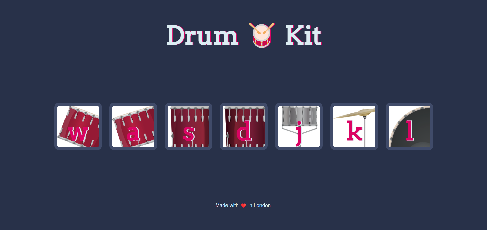
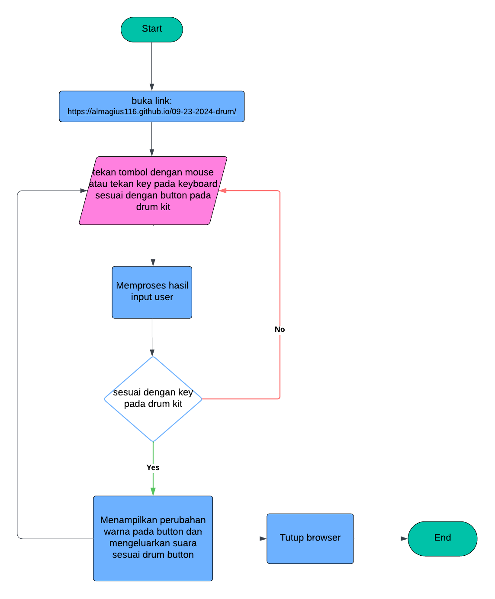

<h1 align="center">
   
  Drum Kit
   
</h1>

<h4 align="center">Tampilan website drum kit</h4>

## Flowchart

## How To Use
Memainkan drum kit

* Buka link : https://almagius116.github.io/09-23-2024-drum/
* Tekan mouse atau keyboard sesuai dengan tombol:
  - "w", tom 1
  - "a", tom 2
  - "s", tom 3
  - "d", tom 4
  - "j", snare
  - "k", crash
  - "l", kick 

